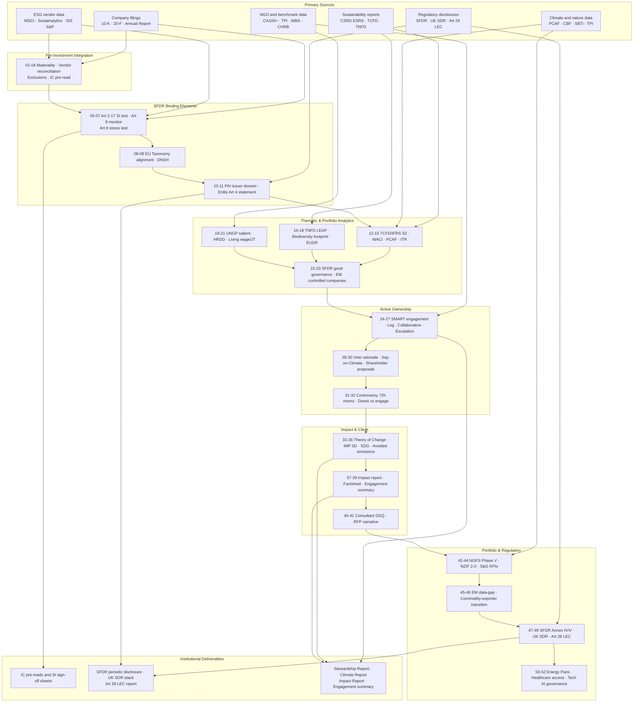

# Sustainable Investment Agent Workflow and Prompt Library for SFDR Article 8 & 9 Funds

**Institutional-grade AI prompts for buy-side Sustainable Investment analysts running SFDR Article 8 and Article 9 global public equity strategies.**

Version 1.0 · 52 prompts · 18 categories · Full SFDR + UK SDR workflow coverage · DM / EM / Frontier

---

## Overview

This library is a curated set of **52 prompts** engineered for the specific workflows of a buy-side Sustainable Investment analyst operating under SFDR Article 8 and Article 9, UK SDR, and Article 29 LEC. It codifies the analytical methodology expected at UK/EU-regulated asset managers running global public equity strategies — spanning pre-investment integration, binding-element testing, Sustainable Investment qualification, EU Taxonomy alignment, Principal Adverse Impact (PAI) assessment, climate and nature analytics, stewardship and proxy voting, impact measurement, controversy response, client reporting, RFP/DDQ workflows, and regulatory disclosure.

The library is platform-agnostic. It works on Claude, ChatGPT, Gemini, and any frontier LLM with sufficient context for structured XML prompts. Every prompt is built on a canonical seven-block XML architecture with a shared issuer + fund header, a four-tier confidence taxonomy, mandatory anti-greenwashing and MNPI guardrails, and a self-evaluation rubric — the things that turn a generic LLM output into something a senior analyst can sign off into an IC memo, a SFDR Annex V, or a client's stewardship report.

## Workflow Coverage

## What's Included

The repository is organised for immediate deployment. Every file is plain UTF-8 markdown with no binary dependencies.

**`library/PROMPT_LIBRARY.md`** — the full 52-prompt library in a single file with navigable table of contents and anchor links. This is the primary working document; upload it as a Claude Project knowledge file or browse it as a reference.

**`library/PROMPT_HEADER.md`** — the canonical issuer + fund header (Prompt 00) extracted as a standalone file for persistent use. Paste into Claude Project system instructions, a Custom GPT's instructions field, or a Gemini Gem's persona so every downstream prompt inherits the header variables.

**`docs/GITHUB_DESKTOP_SETUP.md`** — step-by-step GitHub Desktop walkthrough covering Git identity configuration, repository initialisation, publishing, and day-to-day update workflows.

**`docs/CATEGORIES.md`** — one-line summaries of all 52 prompts grouped by category, for fast lookup when you don't need the full XML spec.

**`CHANGELOG.md`** — version history starting at v1.0.

**`CONTRIBUTING.md`** — prompt schema template and contribution standards for issues and pull requests.

**`LICENSE`** — Creative Commons Attribution 4.0 International (methodology/content licence mirroring the public-prompt-library convention).

**`.gitignore`** and **`.gitattributes`** — standard housekeeping; LF line endings on all text files to prevent Windows/Mac CRLF noise.

## Library Structure

The 52 prompts are organised into 18 categories covering the full buy-side Sustainable Investment lifecycle:

| # | Category | Prompts | Workflow stage |
|---|---|---|---|
| 0 | Shared components (canonical header) | 00 | Setup |
| 1 | Pre-investment ESG integration | 01–04 | Pre-investment |
| 2 | SFDR binding elements & SI testing | 05–07 | Pre-investment |
| 3 | EU Taxonomy & DNSH | 08–09 | Pre-investment |
| 4 | PAI assessment & reporting | 10–11 | Pre-investment + disclosure |
| 5 | Climate analytics (TCFD, ITR, WACI, PCAF) | 12–15 | Analytics |
| 6 | Nature, biodiversity & TNFD | 16–18 | Analytics |
| 7 | Social & human rights | 19–21 | Analytics |
| 8 | Governance deep dive (incl. EM controlled-company) | 22–23 | Analytics |
| 9 | Stewardship & engagement | 24–27 | Active ownership |
| 10 | Proxy voting | 28–30 | Active ownership |
| 11 | Controversy & incident response | 31–32 | Active ownership |
| 12 | Thematic & impact analysis (SDG, IMM, ToC) | 33–36 | Impact measurement |
| 13 | Client reporting & communications | 37–39 | Client reporting |
| 14 | RFP / DDQ responses | 40–41 | Distribution |
| 15 | Portfolio-level ESG analytics | 42–44 | Portfolio analytics |
| 16 | EM / Frontier market adaptations | 45–46 | EM/Frontier |
| 17 | Regulatory reporting (SFDR periodic, SDR, Art 29 LEC) | 47–49 | Regulatory |
| 18 | Sector-specific deep-dives (energy, healthcare, tech) | 50–52 | Sector |

## Design Principles

Four principles distinguish this library from generic ESG prompt templates.

**Canonical seven-block XML architecture.** Every prompt uses the same structural skeleton: `<role>`, `<context>`, `<inputs>`, `<task>`, `<reasoning>`, `<output_format>`, `<constraints>`, `<self_evaluation>`. Outputs are predictable, parseable, and comparable across issuers.

**Shared issuer + fund header.** Defined once in Prompt 00 and imported by all downstream prompts. Standardises the issuer identifier block (name, ticker, ISIN, FIGI, GICS, SASB SICS, country of risk, market cap, ownership type) and the fund context block (SFDR classification, intended SFDR 2.0 category, SDR label, benchmark, reference benchmark type, minimum SI%, minimum Taxonomy%). Prompts become portable across tickers, sectors, and regions without rewriting the header each time.

**Four-tier confidence taxonomy.** `HIGH_CONFIDENCE` (primary disclosed source), `MEDIUM_CONFIDENCE` (inferred from aligned sources), `LOW_CONFIDENCE` (single qualitative source), `UNVERIFIED` (not substantiated). Every numeric claim carries a source ID `[S#]`; unsupported claims are marked `[UNSUPPORTED]`. Calibration, not false precision.

**Compliance guardrails built-in.** Every analytical prompt includes a red-team / pre-mortem step, an anti-greenwashing check (FCA AGR + FG24/3 four Cs), an MNPI flag, the firm's no-advice disclaimer, and a self-evaluation rubric scoring 1–5 on grounding, coverage, calibration, materiality, and compliance.

## Regulatory Grounding

The library is built on (and explicitly cites) the current 2025–2026 regulatory stack. Every prompt references the relevant standards in its `<role>` and `<reasoning>` blocks so outputs can be traced back to authoritative sources.

**EU sustainable finance regime.** SFDR (Reg 2019/2088) + Level 2 RTS (CDR 2022/1288); SFDR 2.0 Commission proposal (20 Nov 2025); EU Taxonomy (Reg 2020/852) + Climate Delegated Act (CDR 2021/2139) + Complementary Climate DA (2022/1214) + Environmental Delegated Act (June 2023); CSRD + ESRS as simplified by Omnibus I Dir (EU) 2026/470; CSDDD; EUDR (Reg 2023/1115 + 2025/2650 + Implementing Reg 2025/1093); EU Methane Regulation; EU AI Act phasing; PAB/CTB Climate Benchmark Regulation 2020/1818; ESMA Guidelines on funds' names using ESG/sustainability terms (applied 21 May 2025).

**UK regime.** UK SDR PS23/16 + FG24/3; FCA anti-greenwashing rule (ESG 4.3.1R); UK Stewardship Code 2020; UK SRS 2026.

**Global disclosure standards.** IFRS S1/S2 (ISSB); SASB Standards (now IFRS-administered); TCFD (final report 2017, absorbed by IFRS S2 from FY24); TNFD v1.0 (Sept 2023); Transition Plan Taskforce (TPT) Disclosure Framework; GRI Standards; CDP.

**Climate and nature methodologies.** PCAF Global GHG Standard Part A 3rd ed. (Dec 2025); IIGCC Net Zero Investment Framework 2.0 (June 2024); SBTi Corporate Net-Zero Standard v1.3.1 + V2.0 consultation; NZAM; NGFS Phase V scenarios (Nov 2024); CA100+ Net Zero Company Benchmark 2.0; TPI MQ + CP frameworks; OGMP 2.0 Gold Standard Level 5; Iceberg Data Lab CBF 3.0; CDC Biodiversité GBS; SBTN; ENCORE; IUCN Global Ecosystem Typology 2.0; WRI Aqueduct 4.0; WBCSD Guidance on Avoided Emissions v2.0 (2025).

**Social and human rights.** UN Guiding Principles on Business and Human Rights (UNGPs); OECD Due Diligence Guidance for Responsible Business Conduct + Sectoral Guidances; ILO Core Conventions; Anker / Global Living Wage Coalition methodology; LkSG; Loi de Vigilance; UK/Australia/Canada Modern Slavery Acts; UFLPA; CHRB; KnowTheChain; ATMI; AMR Benchmark; WBA Just Transition Assessment.

**Stewardship and impact.** PRI Active Ownership 2.0; PRI Advance; Federated Hermes EOS milestone framework; Operating Principles for Impact Management (OPIM); Impact Management Project / Impact Frontiers Five Dimensions; IRIS+ Core Metrics Set; SDG Impact Standards; 60 Decibels; BlueMark.

**Regional disclosure regimes.** India BRSR Core; China CSDS + MOF Application Guide (Sept 2025); Brazil CVM Res 193; HKEX Appendix C2; SGX; Japan SSBJ; ASEAN Taxonomy v4; South Africa King IV + JSE; Article 29 LEC (FR).

## How to Use

Three deployment patterns, progressively more invested.

**1. Reference document.** Browse `library/PROMPT_LIBRARY.md` on GitHub, copy the prompt you need, populate the issuer + fund header variables from Prompt 00, and paste into Claude (or any LLM that handles XML-tagged prompts well). Easiest entry point, no setup required.

**2. Claude Project knowledge.** Create a new Claude Project named e.g. "SFDR Analyst Workbench". Upload `library/PROMPT_HEADER.md` into the Project's system instructions so the canonical header is always active. Upload `library/PROMPT_LIBRARY.md` as a knowledge file. Then trigger prompts conversationally: *"Run prompt 12 (TCFD/IFRS S2) on Iberdrola"* or *"Apply prompt 22 (good governance) to Aramco with controlled-company overlay"*. Claude resolves the prompt ID against the library and applies it to the issuer. Best for daily analyst use.

**3. Slash commands (Claude Code).** Convert each prompt to a slash command by saving individual prompt blocks as `.md` files in `~/.claude/commands/sfdr/` with the prompt ID as filename (e.g. `esg.climate.tcfd_ifrss2.v2.md`). Then invoke as `/esg.climate.tcfd_ifrss2.v2` in Claude Code with the issuer header passed as arguments. Best for high-volume, repeat workflows.

Whichever pattern you choose, **always populate the canonical issuer + fund header from Prompt 00 first** — every downstream prompt assumes those variables are bound.

## Limitations and Human-in-the-Loop

This library is a **scaffolding tool, not a replacement for analyst judgement**. The 2024–2025 academic literature (ESGReveal, ESGenius, ChatReport) converges on the finding that LLMs raise KPI-extraction accuracy from ~30% to ~70%+ when prompts include explicit term glossaries and RAG grounding, but still fail adversarially on niche SASB/IFRS and sector-specific standards.

Pair this library with (i) a gold-standard eval suite per prompt; (ii) issuer-specific RAG grounding (10-Ks, sustainability reports, periodic disclosures, NGO reports); (iii) compliance sign-off on marketing-facing outputs; and (iv) quarterly review of prompts against ESMA CSA findings and FCA enforcement posture.

The analyst, not the model, remains the responsible party under PRI, SFDR, SDR, FCA Principles, and the firm's investment management agreements.

## Versioning and Maintenance

The library is versioned as code, not a static document. Every material regulatory shift triggers a prompt-review cycle and a `CHANGELOG.md` entry. Current watch list:

- SFDR 2.0 trilogue and final text
- CSRD simplification delegated act (mid-2026)
- Omnibus I CSDDD transposition by 26 July 2028
- EUDR application 30 December 2026 (large/medium) and 30 June 2027 (micro/small)
- SBTi Corporate Net-Zero Standard V2.0 finalisation
- PCAF Part A revisions
- ISSB biodiversity / human-capital standards
- EU AI Act high-risk phase August 2026 and Annex I products August 2027
- ESMA fund-names interpretive updates
- UK SDR overseas-funds extension

Prompt ID conventions (`esg.<category>.<function>.v<n>`) and self-evaluation rubrics are the control plane that make versioning manageable at scale.

## Author

**Ed** — London-based buy-side investment professional with ~8 years across responsible investment and equity research, including roles at The Global Fund (Geneva) and Baillie Gifford (Edinburgh). BSc Biomedicine, MSc Global Health, CFA charterholder + CFA ESG Certificate. Builds and publishes institutional-quality Claude skills and frameworks for investment workflows.

## License

Released under **Creative Commons Attribution 4.0 International (CC BY 4.0)**. See [LICENSE](LICENSE). You are free to share and adapt the material for any purpose, including commercial, provided attribution is given. Content/methodology licence, mirroring the convention for public prompt libraries.

## Contributing

Issues and pull requests welcome. See [CONTRIBUTING.md](CONTRIBUTING.md) for the prompt schema template and standards. Particularly valuable contributions: (a) regulatory updates as new RTS / Delegated Acts publish, (b) sector-specific deep-dive prompts beyond the three included (50–52), (c) gold-standard eval pairs (input → expected output) for any prompt, (d) translations of consumer-facing outputs (UK SDR consumer-facing disclosures, German PIB equivalents, French Article 29 LEC language).

## Acknowledgements

Methodology synthesis draws on public regulatory texts, asset manager sustainability reports and stewardship reports (Baillie Gifford Positive Change, Wellington Global Impact, Robeco SDG, Schroders SustainEx, Mirova, Federated Hermes EOS, Candriam, Nordea STARS), NGO benchmarks (CA100+, TPI, WBA, CHRB, ATMI, AMR Benchmark, FAIRR, RDR, GCEL/GOGEL), academic research on ESG rating divergence (Berg, Kölbel, Rigobon 2022), and LLM-for-ESG evaluation literature (ESGReveal, ESGenius, ChatReport).

## Disclaimer

For internal research and educational purposes only. Outputs generated by these prompts are not investment advice, recommendations, or solicitations to buy or sell securities. Use of this library does not create a fiduciary or advisory relationship. Users remain responsible for compliance with all applicable regulations including but not limited to SFDR, UK SDR, FCA Principles, MiFID II, AIFMD, UCITS, and local distribution rules.
